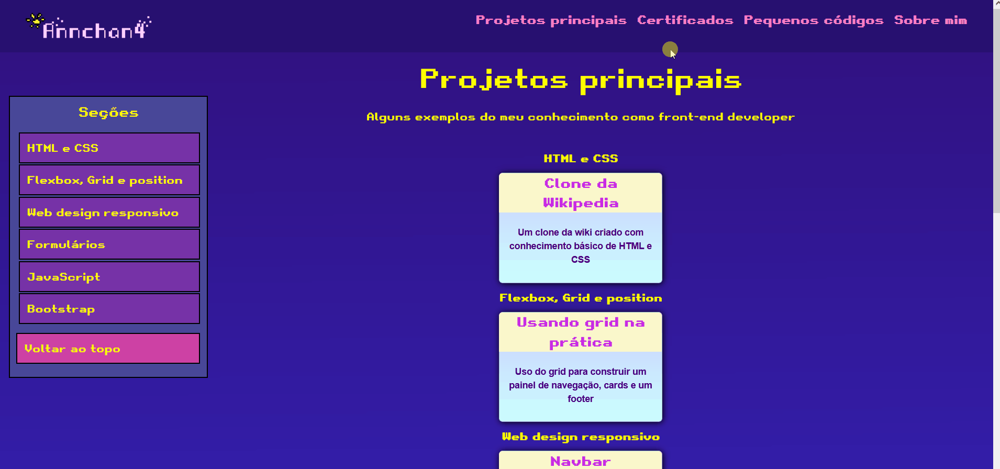
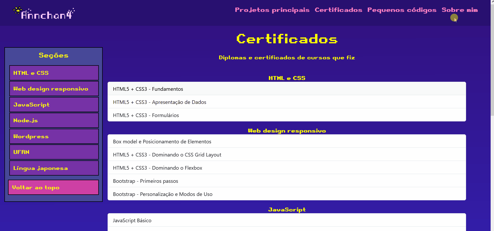
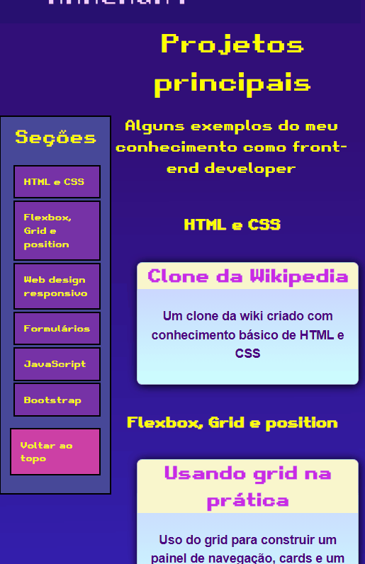
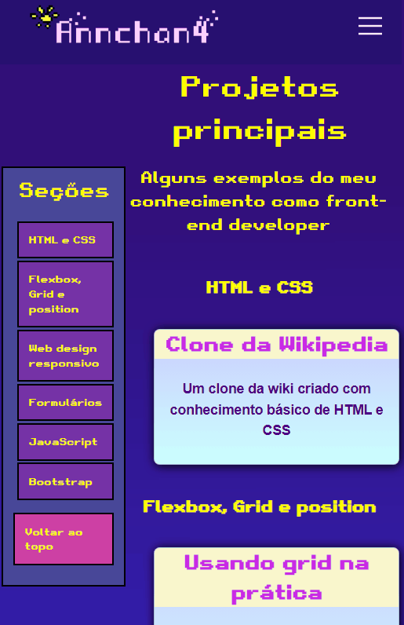

# Portfólio de Annie Rocha (Annchan4) 
Meu website para portfólio, com exemplos de projetos mais reais e pequenos códigos, assim como uma página com mais detalhes sobre mim (e informações para contato)  e os certificados de cursos que eu obtive. As páginas são estilizadas usando CSS e o Bootstrap 💻

## 💻Versão desktop
### Projetos principais

### Certificados

### Sobre mim

## 📱Versão mobile
Projetos principais|Certificados|Sobre mim
:-------------------------:|:-------------------------:|:-------------------------:
||

## 🛠Tecnologias Utilizadas
- HTML
- CSS
- Javascript
- Boostrap

